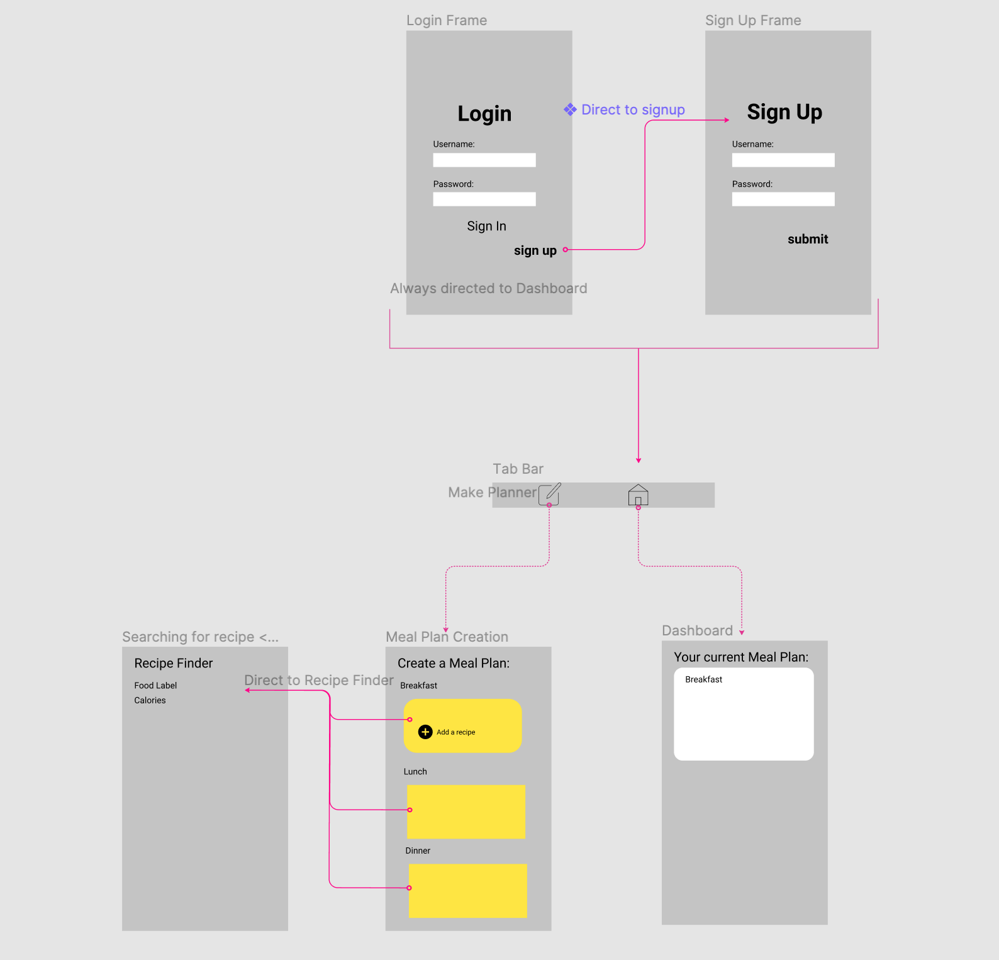
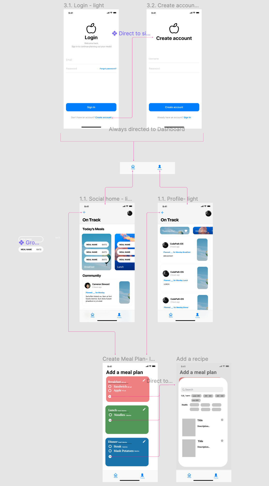

# OnTrack

## Table of Contents
1. [Overview](#Overview)
1. [Product Spec](#Product-Spec)
1. [Wireframes](#Wireframes)
2. [Schema](#Schema)
3. [Gifs](#Sprint-1-gifs)

## Overview
### Description
The application allows users to plan their meals for the next week, and check the meals they have planned for the day.

### App Evaluation
[Evaluation of your app across the following attributes]
- **Category:** Health & Fitness/Lifestyle
- **Mobile:** The app is suited for mobile use since it gives users easy access to see their meal plans daily and be notified daily.
- **Story:** Everyone starts the year with a fitness goal, part of this goal is starting and continuing a healthier diet – with this tracker it helps keeps yourself accountable and be able to see the progress you are making.
- **Market:** The app would be targeted towards those who desire to track their food intake.
- **Habit:** The users would open this app every day to check the meals they have planned for the day. Every start of the week, they would spend more time setting up the meal plan.
- **Scope:** The application would have the core feature of being able to set a plan for the week, and letting the users browse through a selection of recipes. Since we are not building out the API from scratch, this would be doable in the duration of this program.

## Product Spec

### 1. User Stories (Required and Optional)

**Required Must-have Stories**

* [x] Users are able to login/sign-up/logout from the application
* [x] Users are able to create a meal plan for the week
* [ ] Users are able to edit/delete/save a meal plan
* [ ] Users can check off meals/days.
* [x] Able to see a list of recipes based on their desired amount of calories

**Optional Nice-to-have Stories**
* [ ] Users are able to create their own recipes.
* [x] Users are able to see other user's meal plans: 
    * [ ] Commenting to share words of encouragement
    * [ ] Users are able to like other users meal plans to show support

### 2. Screen Archetypes

* Login Screen
    * Users are able to login/sign-up/logout from the application
* Sign Up Screen
    * Users are able to login/sign-up/logout from the application
* Dashboard Screen
    * Users can check off meals/days
    * Users are able to edit/delete/save a meal plan
* Create Meal Plan
    * Users are able to create a meal plan for the week
    * Able to see a list of recipes based on their desired amount of calories

### 3. Navigation

**Tab Navigation** (Tab to Screen)

* Dashboard Screen
* Create Meal Plan

**Flow Navigation** (Screen to Screen)

* Dashboard Screen
   * See detail view of meal – view meals planned for a day
* Create Meal Plan
   * Access different recipes 
   * Designate what meals to cook on which day (event planning)

## Wireframes

### [BONUS] Digital Wireframes & Mockups

## Schema 
### Models
#### Meal

   | Property      | Type     | Description |
   | ------------- | -------- | ------------|
   | objectId      | String   | unique id for the user post (default field) |
   | author        | Pointer to User| image author |
   | image         | File     | image of the meal |
   | description   | String   | description of the meal |
   | ingredients   | String[] | list of ingredients for the meal |
   | commentsCount | Number   | number of comments that has been posted to an image |
   | likesCount    | Number   | number of likes for the post |
   | createdAt     | DateTime | date when post is created (default field) |
   | updatedAt     | DateTime | date when post is last updated (default field) |
### Networking
- Login Screen
    - (Read/GET) Get user information based on login information
- Register Screen
    - (Create/POST) Create a new user object
- Dashboard Screen
    - (Read/GET) List out logged in user's plans for the day
    - (Read/GET) List out other user's meal plans
    - (Create/POST) Like on another user's meal plan
    - (Delete) Delete like on another user's meal plan
- Create Meal Segue
    - (Create/POST) Create a new meal object
- Profile Screen
    - (Read/GET) Query logged in user object
    - (Read/GET) Query meal plans posted by user object

#### Existing API Endpoints
##### Edamam Nutrition Analysis API Documentation
- BASEURL - [https://api.edamam.com]

   HTTP Verb | Endpoint | Description
   ----------|----------|------------
    `GET`    | /search | search for recipes
    `GET`    | /search?q=query | query text for the recipes
    `GET`    | /search?calories=calories | calories of the meal
    `GET`    | /search?health=health | health type of the meal
    
## Sprint 1 GIFs:

 

## Sprint 2 GIFs:

